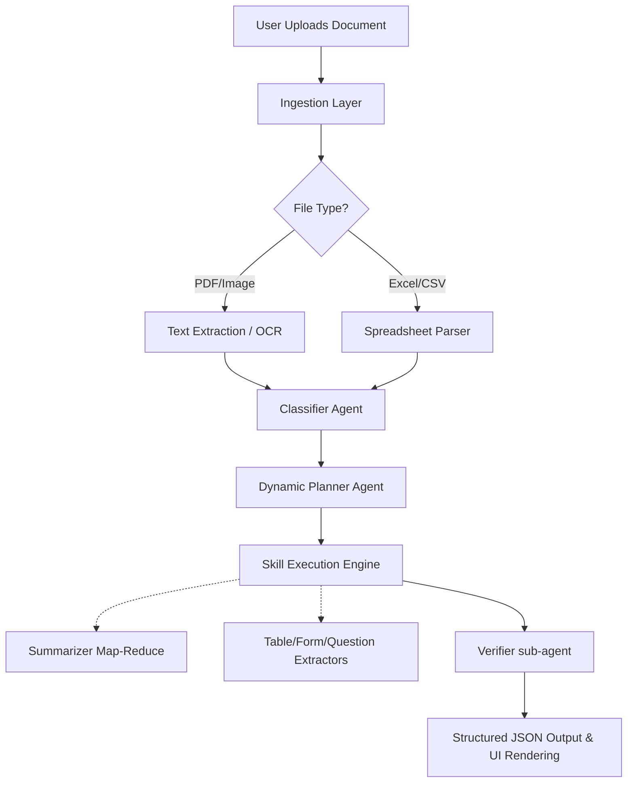

#  Document Analysis Agent

An intelligent, LLM-powered document analysis system that goes beyond simple text extraction. This agent dynamically classifies documents, plans an execution strategy, and routes text/data through a registry of specialized skills to extract structured insights.

##  Core Features

1. **Intelligent Document Classification Step**
   - Before any processing, the agent classifies the document type (e.g., Report, Questionnaire, Invoice, Spreadsheet, Form, Research Paper).
   - This prevents treating every document as generic text and allows for context-aware analysis.

2. **Genuine Skill Registry Architecture**
   - The system is built around a plug-and-play **Skill Registry**.
   - Instead of hardcoding logic, skills (like `extract_tables`, `structured_summary`) are dynamically selected by an LLM-based Planner.
   - **Demo Highlight:** It takes < 30 seconds to add a new skill to the registry and have the agent immediately understand how to use it.

3. **Advanced Spreadsheet (Excel/CSV) Analysis**
   - It doesn't just extract flat text from spreadsheets.
   - It enumerates all sheets, extracts schemas, identifies column types, calculates numeric statistics (min, max, mean), and surfaces anomalies like missing values.

4. **Hierarchical Map-Reduce Summarization for Long Documents**
   - Bypasses LLM context window limits for large documents (e.g., 200+ page PDFs).
   - Chunks text into overlapping segments, summarizes each chunk individually, and synthesizes the chunk summaries into a cohesive final output.

5. **Structured Question & Form Extraction**
   - Extracts questions from questionnaires/forms into structured JSON.
   - Captures question types (MCQ, descriptive, yes/no), options, logical sections, and required/optional status, making the data programmatically useful.

---

##  System Architecture

### Pipeline Flow



### File Structure & Components
*   `app/main.py`: FastAPI application entry point.
*   `app/api/`: API Routers (`routes.py`) and endpoints. Provides the `/analyze` and `/skills` hooks.
*   `app/core/`:
    *   `agent.py`: The Main Orchestrator. Ties all steps together.
    *   `planner.py`: The LLM-based Planner. Decides *which* skills to run based on the classification and query.
    *   `executor.py`: Executes the skills chosen by the planner.
    *   `classifier.py`: The initial document classifier.
    *   `verifier.py`: The final verification stage to prevent hallucinations.
*   `app/skills/`: The true engine.
    *   `base.py`, `registry.py`: The framework powering the Skill abstraction.
    *   `ingestion/`: Skills to read PDFs, OCR scanned images, and parse Excel.
    *   `processing/`: Skills for intermediate processing (e.g., `table_parser.py`).
    *   `understanding/`: Skills for deep comprehension (`summarizer.py`, `form_extractor.py`, `question_extractor.py`, `structured_summarizer.py`).
*   `app/prompts/`: Standardized prompt templates for different LLM tasks.
*   `app/services/`: LLM wrappers and external connectors (e.g., Ollama, Langchain).
*   `frontend/app.py`: Streamlit-based UI for interacting with the agent.

---

##  Use Cases

1.  **Financial Data Analysis:** Upload an Excel file with multiple sheets, and the agent quickly understands the data.
It summarizes key information, identifies patterns, and highlights unusual values — saving time on manual analysis.
2.  **Medical & Legal Form Processing:** Ingest raw patient intake forms or legal questionnaires. The agent extracts the distinct questions and fields, preserving the original form structure as JSON for automated database entry.
3.  **Academic/Research Digestion:** Upload Larger pages research papers. The map-reduce summarization safely handles the context window, delivering a synthesized summary containing the actual conclusions without clipping.

---


---

##  Quick Setup (Local Dev)

**Prerequisites:**
*   Python 3.10+
*   [Ollama](https://ollama.com/) (running locally)

**1. Install & Pull Model:**
```bash
ollama pull gemma4:e4b
```

**2. Setup Python Environment:**
```bash
python -m venv venv
source venv/bin/activate
pip install -r requirements.txt
```

**3. Run the Backend & Frontend:**
```bash
# Terminal 1 - FastAPI Server
uvicorn app.main:app --reload --port 8000

# Terminal 2 - Streamlit UI
streamlit run frontend/app.py
```
